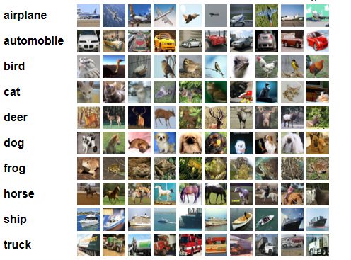

# **CS486-Final-Project: DefenseGAN on CIFAR-10**

Welcome to my final project for CS486 (Robust Machine Learning). For this project I implement the DefenseGAN method for [CIFAR-10](https://www.cs.toronto.edu/~kriz/cifar.html) images. The goal is to protect three well-known image classifiers: [VGG16](https://arxiv.org/abs/1409.1556), [MobileNetV2](https://arxiv.org/abs/1801.04381), and [ResNet18](https://arxiv.org/abs/1512.03385) from adversarial perturbations in both white-box, and black-box scenarios. 

## **CIFAR-10** 

The CIFAR-10 dataset is a well known benchmark in computer vision, comprised of 32x32 RGB images of 10 different classes. 

It's widely used in both image generation and classification, making it an suitable test for the DefenseGAN method.

## **DefenseGAN**

TODO

## **Results** 

TODO

### **WGAN-GP**

TODO

### **Classifiers**

TODO

### **DefenseGAN**

TODO

### **References**

TODO