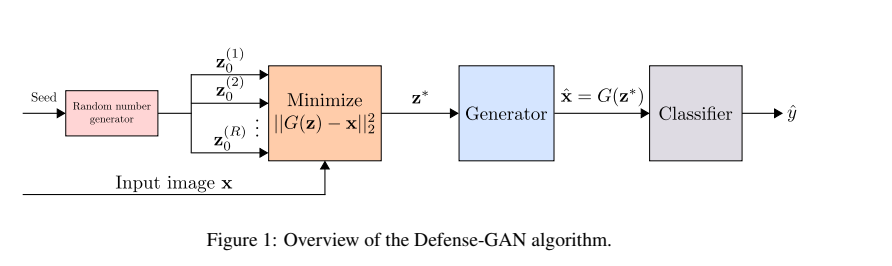
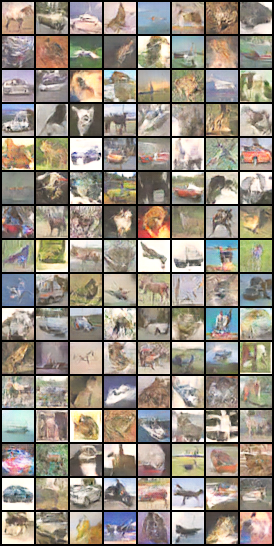
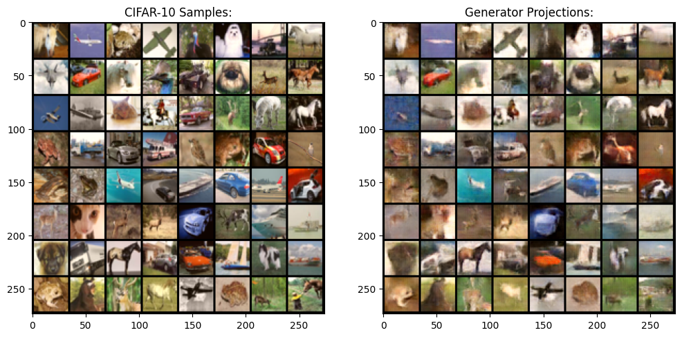

# **CS486-Final-Project: DefenseGAN on CIFAR-10**

Welcome to my final project for CS486 (Robust Machine Learning). For this project I implement the DefenseGAN method for [CIFAR-10](https://www.cs.toronto.edu/~kriz/cifar.html) images. The goal is to protect three well-known image classifiers: [VGG16](https://arxiv.org/abs/1409.1556), [MobileNetV2](https://arxiv.org/abs/1801.04381), and [ResNet18](https://arxiv.org/abs/1512.03385) from adversarial perturbations in both white-box, and black-box scenarios. 

1. [Usage](#usage)
2. [DefenseGAN](#defensegan)
3. [Results](#results)
    - WGAN-GP
    - Classifiers
    - DefenseGAN
4. [References](#references)

## **Usage**

### **Notebooks**


### **Scripts**

**train_gan.py**

``` console
> python train_gan.py -h
usage: train_gan.py [-h] [--batch_size BATCH_SIZE] [--epochs EPOCHS] [--lambda_gp LAMBDA_GP] [--critic_iters CRITIC_ITERS] [--latent_len LATENT_LEN] [--learning_rate LEARNING_RATE] [--display_step DISPLAY_STEP] [--save_step SAVE_STEP]

Train a GAN model on CIFAR-10

options:
  -h, --help            show this help message and exit
  --batch_size BATCH_SIZE
                        Batch size for training
  --epochs EPOCHS       Number of training epochs
  --lambda_gp LAMBDA_GP
                        Lambda for gradient penalty
  --critic_iters CRITIC_ITERS
                        Number of critic iterations
  --latent_len LATENT_LEN
                        Length of latent vector for generator
  --learning_rate LEARNING_RATE
                        Learning rate for optimizers
  --display_step DISPLAY_STEP
                        Steps for visual inspection
  --save_step SAVE_STEP
                        Steps for saving the model
```
**fetch_pretrained.sh**

## **DefenseGAN**

DefenseGAN is an innovative approach to improving the robustness of deep neural networks against adversarial attacks. Leveraging the generative capabilities of Generative Adversarial Networks (GANs), DefenseGAN works by training a GAN to model the distribution of unperturbed training data. During inference, it projects inputs onto the learned data manifold before feeding them to the target neural network. This projection process effectively helps to mitigate the effects of adversarial perturbations. DefenseGAN acts as a preprocessing step, reconstructing inputs to be more akin to natural data, thus enhancing the robustness of neural networks in recognizing and dealing with adversarial examples.

Inference Pipeline: 




## **Results**

### **WGAN-GP**

The researchers use Wasserstien GANS to create a smoother manifold, making projection onto the generator's range easier. While other architectures and loss combinations (ex. StyleGAN) result in better quality images, Projections onto those manifolds is a much more compute-intensive process. 

Sample Generator output (No latent vector refinement):



(see train_gan.py for the hyperparameter details)

### **Classifiers**

Three classifier architectures,  [VGG16](https://arxiv.org/abs/1409.1556), [MobileNetV2](https://arxiv.org/abs/1801.04381), and [ResNet18](https://arxiv.org/abs/1512.03385) are adapted for use on the small images in the CIFAR-10 Dataset (see this [repo](https://github.com/kuangliu/pytorch-cifar) for implementation specifics)

The performance on the CIFAR-1o Testing Dataset is as follows:

* VGG16: 92.97%
* MobileNetV2: 92.25% 
* ResNet18: 94.71%

### **DefenseGAN**




| Model | No Attack | FGSM Attack | $L_{\infty}$ Attack |
| -----| ---------|  -----------| ---------------|
| VGG16 | 93.04% | 1.534% | 2.18% | 
| MobileNetV2 | 92.26% | 3.36% | 0.54% |
| ResNet18 | 94.73% | 2.56% |  1.11% | 
| VGG16 (With DefenseGAN) | 55.81% | 38.66% | 46% |
| MobileNetV2 (With DefenseGAN) | 49.15%  | 40.77% | 46% |
| ResNet18 (With DefenseGAN) | 53.63% | 55.13% |48% |

### **References**

* Pouya Samangouei, Maya Kabkab, and Rama Chellappa, 'Defense-GAN: Protecting Classifiers Against Adversarial Attacks Using Generative Models', arXiv preprint arXiv:1805.06605, 2018
* Alex Krizhevsky, 'Learning Multiple Layers of Features from Tiny Images', Technical Report, University of Toronto, 2009
* Kuang Liu, 'pytorch-cifar: 95.47% on CIFAR10 with PyTorch', GitHub repository, https://github.com/kuangliu/pytorch-cifar, 2023
* Ishaan Gulrajani, 'improved_wgan_training/gan_cifar.py: Improved Training of Wasserstein GANs', GitHub repository, https://github.com/igul222/improved_wgan_training/blob/master/gan_cifar.py, 2023"
